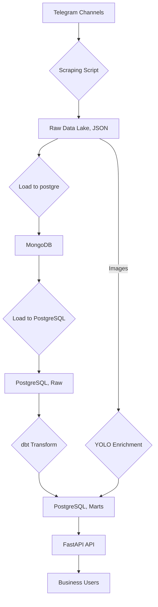
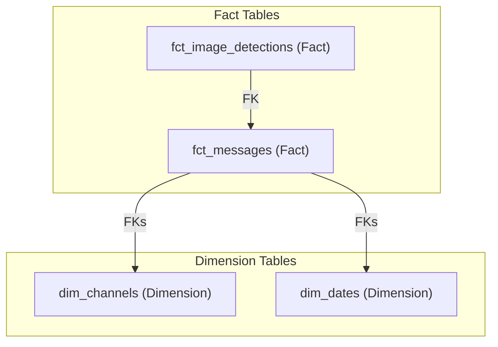

# Telegram Data Pipeline: From Raw Telegram Data to an Analytical API

This project builds an end-to-end data pipeline to extract, transform, and analyze data from public Telegram channels related to Ethiopian medical businesses. It leverages modern data engineering tools to provide actionable insights via an analytical API.

---

## 1. Project Overview

**Business Need:** Generate insights on Ethiopian medical businesses from Telegram data (e.g., top products, channel activity, visual content trends).

**Goals:**
*   Develop a reproducible, containerized environment.
*   Scrape Telegram data into a local data lake.
*   Load raw data into MongoDB, then to PostgreSQL.
*   Transform and model data (star schema) using dbt in PostgreSQL.
*   Enrich data with YOLOv8 object detection on images.
*   Expose insights via a FastAPI analytical API.
*   Orchestrate the pipeline with Dagster.

## 2. Architecture

The pipeline follows an ELT approach with an intermediate MongoDB layer:




## 3. Technologies Used

*   **Data Sources:** Telegram API (Telethon)
*   **Storage:** Local JSON Data Lake, MongoDB (PyMongo), PostgreSQL (Psycopg2)
*   **Transformation:** dbt (Data Build Tool)
*   **Enrichment:** YOLOv8 (Ultralytics)
*   **API:** FastAPI, Pydantic
*   **Orchestration:** Dagster
*   **Environment:** Docker, Docker Compose, python-dotenv

## 4. Project Setup

### Prerequisites
*   Docker & Docker Compose
*   Git

### Steps
1.  **Clone Repo:** `git clone <your-repo-url> && cd <your-repo-name>`
2.  **Configure `.env`:** Copy `.env.example` to `.env` and fill in Telegram, PostgreSQL, and MongoDB credentials.
3.  **Build & Start Containers:** `docker-compose build && docker-compose up -d`
4.  **Configure dbt Profiles:** Create/update `~/.dbt/profiles.yml` with the `telegram_data_warehouse` profile (refer to the full `README` or `dbt_project/profiles.yml` for details).

## 5. Code Structure (Brief)

```
.
├── .env.example
├── Dockerfile
├── docker-compose.yml
├── requirements.txt
├── data/                     # Raw JSON messages and images
├── scripts/                  # Python scripts for scraping, loading (JSON->Mongo, Mongo->PG), YOLO enrichment
├── dbt_project/              # dbt models (staging, marts), tests, config
│   ├── models/
│   │   ├── staging/stg_telegram_messages.sql
│   │   └── marts/dim_channels.sql, fct_messages.sql, fct_image_detections.sql
│   └── tests/
├── fastapi_app/              # FastAPI application (main.py, database.py, schemas.py)
└── dagster_project/          # Dagster orchestration (repository.py, ops.py)
```

## 6. Running the Pipeline

Access the `app` container: `docker-compose exec app bash`

Inside the container (`/app`):

1.  **Scrape & Load Raw Data:**
    ```bash
    python scripts/telegram_scraper.py
    python scripts/load_json_to_mongodb.py
    python scripts/load_mongo_to_postgres.py
    ```
2.  **Transform Data (dbt):**
    ```bash
    cd dbt_project
    dbt build
    cd ..
    ```
3.  **Enrich Data (YOLO):**
    ```bash
    python scripts/yolo_enrichment.py
    ```
4.  **Start FastAPI API:**
    ```bash
    uvicorn fastapi_app.main:app --host 0.0.0.0 --port 8000
    # Access at http://localhost:8000/docs
    ```
5.  **Launch Dagster UI:**
    ```bash
    cd dagster_project
    dagster dev
    # Access at http://localhost:3000
    ```

## 7. Data Model (Star Schema)



## 8. Challenges & Future Improvements

**Challenges:** PostgreSQL connectivity (resolved with MongoDB intermediate), Telegram API rate limits, complex image scraping, advanced NLP for product extraction, data quality.

**Future Improvements:** Enhanced image/video scraping, advanced NLP, incremental loading, comprehensive data quality framework, monitoring, scalability, CI/CD.

---
```
